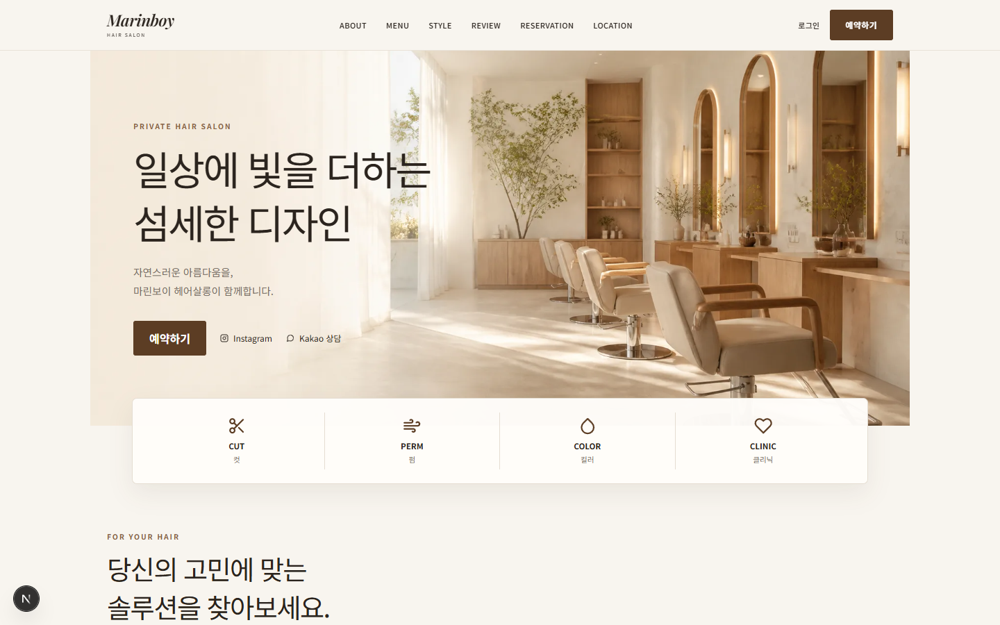
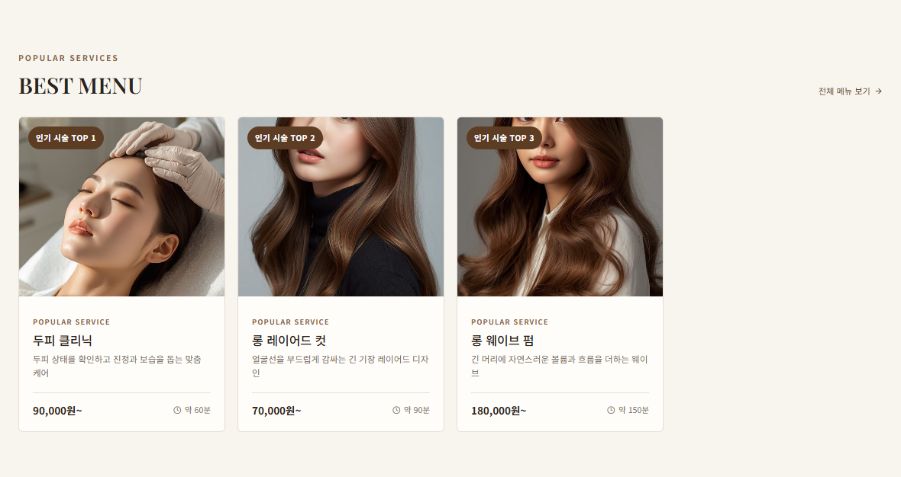
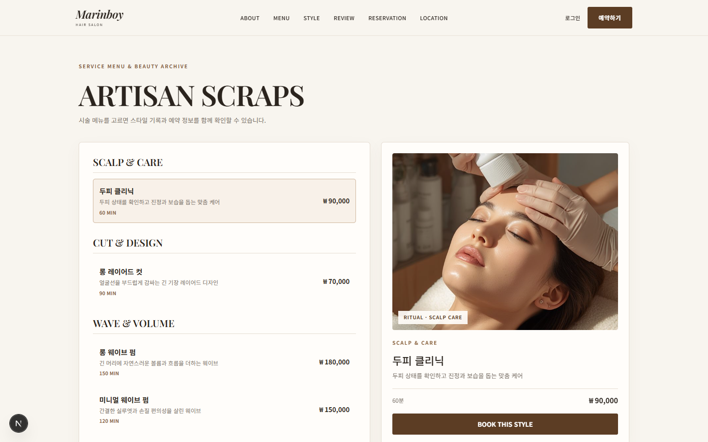

# MarinboySalon v3

> **예약 흐름을 중심으로 설계한 미용실 웹 서비스**
> 고객의 예약 경험과 관리자의 운영 화면을 하나의 REST API 기반 서비스로 연결했습니다.

[](front)
[](back)
[](database)
[](front)

## 프로젝트 소개

**MarinboySalon v3**는 고객이 시술을 탐색하고 원하는 날짜와 시간에 예약한 뒤, 관리자가 예약·시술 메뉴·고객 정보를 운영할 수 있도록 만든 풀스택 웹 서비스입니다.
프런트엔드와 백엔드를 분리해 화면과 API의 역할을 명확히 했고, 예약 중복 방지·JWT 인증·Redis 기반 상태 관리·Google Calendar 연동까지 실제 서비스 흐름에 필요한 기능을 구현했습니다.

| 구분 | 내용 |
| --- | --- |
| 서비스 대상 | 미용실 예약 고객 및 관리자 |
| 핵심 가치 | 시술 탐색부터 예약 확정·운영 처리까지 끊기지 않는 흐름 |
| 개발 구조 | Next.js SPA/SSR 화면과 Spring Boot REST API 분리 |
| 저장소 | [marlboros9889/MarinboySalon](https://github.com/marlboros9889/MarinboySalon) |

## 화면 미리보기

<p align="center">
  
  
  
</p>

| 메인 | 인기 메뉴 | 시술 아카이브 |
| --- | --- | --- |
| 예약으로 이어지는 브랜드 첫 화면 | 우선순위 메뉴를 한눈에 비교 | 상세 시술 탐색 후 예약 화면 이동 |

## 핵심 기능

### 고객 경험

- 시술 메뉴 탐색, 이미지 아카이브 미리보기, 예약 화면 이동
- 날짜·시간을 선택하는 단계형 예약 화면과 선택 결과 요약
- 내 예약 조회·취소, 완료된 본인 예약에 한해 후기 1회 작성
- 일반 로그인과 Google·Kakao·Naver OAuth 로그인 진입

### 관리자 운영

- 신규 요청 수를 표시하는 예약 현황 및 상태 변경
- 시술 메뉴 등록·수정·논리 삭제, 다중 이미지 선택·미리보기·업로드
- 고객 목록·상세·삭제 권한 제어
- Google Calendar 연동 상태 확인과 예약 일정 생성 결과 관리

## 핵심 문제 해결

| 문제 | 해결 방식 | 사용자에게 보이는 결과 |
| --- | --- | --- |
| 같은 시간에 예약이 겹칠 수 있음 | 예약 생성 전 슬롯을 다시 검사하고, 활성 예약 상태를 기준으로 중복을 차단 | 이미 선택된 시간은 예약할 수 없음 |
| 로그인 상태를 안전하게 유지해야 함 | JWT Access/Refresh Token과 Redis 기반 인증 상태를 사용 | 고객·관리자 권한별 화면과 API 접근 제어 |
| 예약 이후 운영 일정이 분리됨 | DB 저장 완료 뒤 Google Calendar 이벤트를 비동기로 생성하고 이벤트 ID 저장 | 예약 데이터와 외부 일정 연결 추적 |
| 시술 이미지를 관리하기 번거로움 | 관리자가 파일 선택·미리보기 후 다중 업로드하도록 구현 | URL 입력 없이 메뉴 이미지를 관리 |

## 설계·보안 점검

아래는 주요 경로를 기준으로 소스와 설정을 점검한 결과입니다.

| 항목 | 확인 결과 | 보완할 점 |
| --- | --- | --- |
| 동시 예약 방지 | 예약 날짜·30분 슬롯을 PK로 가진 reservation_slot_lock 행을 먼저 잠그고, 그 뒤 겹치는 예약을 다시 검사합니다. 겹치는 시술만 같은 슬롯에서 대기합니다. | 운영 DB에는 database/migrations/20260831_reservation_slot_lock.sql을 한 번 적용해야 합니다. |
| 관리자 API 권한 | SecurityConfig가 /api/admin/**를 hasRole(ADMIN)으로 보호합니다. 프런트도 직접 접근 시 비로그인은 로그인 화면으로, 일반 고객은 홈으로 이동시킵니다. | 서버 API 권한 검사를 최종 방어선으로 계속 유지합니다. |
| 후기 작성 | 서버에서 예약 소유자·COMPLETED 상태를 검증하고, review.reservation_id UNIQUE 제약으로 예약당 후기 1건을 DB에서도 보장합니다. | - |
| MyBatis SQL | mapper/ XML에서 문자열 치환을 사용하지 않고 파라미터 바인딩을 사용합니다. | 동적 SQL을 새로 추가할 때도 같은 규칙을 유지합니다. |
| OAuth2 콜백 | 성공·실패 리다이렉트 대상은 서버 설정의 app.front-url을 사용하고, access token을 URL에 싣지 않습니다. | OAuth 제공자 콘솔의 콜백 주소와 동의 항목은 배포 환경마다 별도 점검이 필요합니다. |
| 토큰 보관 | access token은 프런트 메모리, refresh token은 HttpOnly 쿠키를 사용하며 브라우저 저장소 사용 흔적이 없습니다. | 새 인증 기능 추가 시 localStorage/sessionStorage 저장을 피합니다. |
| 업로드 정적 서빙 | 이미지 저장 경로를 절대 경로로 정규화하고, /uploads/service-items/** 경로로만 노출합니다. | 업로드 파일명·확장자·크기 정책도 지속적으로 서버에서 검증합니다. |
| Google Calendar | @TransactionalEventListener(AFTER_COMMIT)으로 DB 커밋 후에만 비동기 일정 생성을 호출하고, 성공한 이벤트 ID를 calendar_event_id에 저장합니다. | 외부 API 실패는 예약을 되돌리지 않으므로 운영 시 재시도·모니터링 정책을 추가로 둘 수 있습니다. |

## 시스템 구성

```text
Browser
  └─ Next.js + React + Redux / Redux-Saga
       └─ Axios REST API
            └─ Spring Boot + Spring Security + MyBatis
                 ├─ MySQL 8          예약·회원·메뉴·후기 데이터
                 ├─ Redis 7          인증/상태 관리
                 └─ Google Calendar  예약 확정 후 일정 연동
```

```text
MarinboySalon_v3
├─ front/       Next.js 고객·관리자 화면, Redux-Saga, Axios
├─ back/        Spring Boot REST API, MyBatis, JWT, Redis
├─ database/    MySQL 스키마와 초기 데이터
└─ docs/        프로젝트 문서와 README용 화면 이미지
```

## 예약 처리 흐름

```text
시술 선택 → 날짜 선택 → 가능한 시간 조회 → 로그인 확인 → 예약 생성
                                                ↓
                                중복 슬롯 재검사 · 상태 REQUESTED 저장
                                                ↓
                         DB 커밋 후 Google Calendar 이벤트 비동기 생성
                                                ↓
                              calendar_event_id 저장 → 관리자 상태 처리
```

## 기술 스택

| 영역 | 사용 기술 |
| --- | --- |
| Frontend | Next.js 15, React 18, Redux, Redux-Saga, Axios, Bootstrap 5 |
| Backend | Java 17, Spring Boot 3, Spring Security, MyBatis, Gradle |
| Data | MySQL 8, Redis 7 |
| Integration | Google Calendar API, OAuth 2.0 (Google/Kakao/Naver) |
| Test | JUnit/Spring Security Test, Jest |

## 로컬 실행

### 1. 사전 준비

- Java 17, Node.js 20.9 이상, MySQL 8, Redis 7
- MySQL에 `marinboy_salon` 데이터베이스를 준비하고 `database/`의 SQL을 적용합니다.
- 기존 DB를 사용한다면 `database/migrations/20260831_reservation_slot_lock.sql`도 적용합니다.
- Redis를 먼저 실행합니다. Redis가 꺼져 있으면 인증·헬스 체크가 실패할 수 있습니다.

### 2. 백엔드 실행

```powershell
cd back
.\gradlew.bat bootRun
```

백엔드: `http://localhost:8082`
헬스 체크: `http://localhost:8082/actuator/health`

### 3. 프런트엔드 실행

```powershell
cd front
npm install
npm run dev
```

프런트엔드: `http://localhost:3000`

> V3는 백엔드 포트 **8082**를 사용합니다. V1·V2의 8080 서버를 동시에 실행하지 않는 것을 권장합니다.

## 환경 변수

민감한 값은 저장소에 넣지 않고 로컬 환경 변수로 설정합니다.

```powershell
# MySQL / Redis
$env:DB_USERNAME = 'root'
$env:DB_PASSWORD = 'your-password'
$env:REDIS_HOST = 'localhost'

# Google Calendar (선택)
$env:GOOGLE_CALENDAR_ENABLED = 'true'
$env:GOOGLE_CALENDAR_ID = '공유받은-캘린더-ID'
$env:GOOGLE_CALENDAR_CREDENTIALS_PATH = 'C:\absolute\path\service-account.json'
```

Google Calendar를 사용할 때는 서비스 계정 이메일을 대상 캘린더에 **일정 변경 권한**으로 공유해야 합니다.

## 검증 결과

2026-08-31 로컬 환경에서 아래 항목을 확인했습니다.

| 구분 | 확인 항목 | 결과 |
| --- | --- | --- |
| Backend test | Gradle 테스트 14 suites / 23 tests | 통과 |
| Frontend test | Jest 7 suites / 15 tests | 통과 |
| API | `/actuator/health`, `/api/service-items` | 200 OK |
| 화면 | 메인, 시술 목록, 예약 화면 | 200 OK |
| 동시성 | 같은 슬롯은 대기, 다른 슬롯은 즉시 처리 | MySQL 실측 확인 |
| 관리자 경로 | 비로그인 `/admin/users` 직접 접속 | 로그인 화면으로 리다이렉트 확인 |

테스트 명령:

```powershell
# back/
.\gradlew.bat test

# front/
npm test -- --runInBand
```

## 포트폴리오 발표 자료

별도로 제작한 취업 면접용 발표 자료는 프로젝트의 문제 정의, 화면 설계, 예약 충돌 방지, 인증·Calendar 연동, 검증 결과를 담고 있습니다.

> 발표 파일은 배포 시 저장소의 `docs/portfolio/`에 추가하거나 GitHub Releases에 첨부할 수 있습니다.

## 버전 구분

| 버전 | 구조 |
| --- | --- |
| v1 | Spring MVC + JSP + MyBatis + MySQL |
| v2 | Spring Boot 기반 SSR 및 관리자 기능 확장 |
| v3 | Next.js 프런트엔드와 Spring Boot REST API 완전 분리 |
