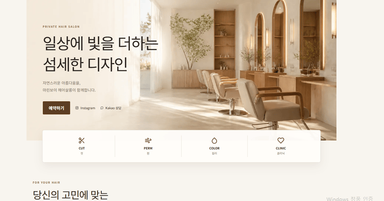

# 💇 [MarinboySalon — 1인 헤어살롱 예약·운영 플랫폼](https://marinboysalon.duckdns.org/)

<h3 align="center">고객 예약부터 관리자 운영까지 연결한 1인 헤어살롱 풀스택 플랫폼</h3>
## ✨ 화면 포트폴리오

> 고객 화면 → 예약 과정 → GIF를 클릭하면 배포 서비스가 새 탭에서 열립니다.

  

고객 서비스 · 로그인과 예약 · 내 예약 · 관리자 예약·시술·이벤트·계정 관리

  같은 시간대 예약은 서버와 데이터베이스에서 한 번 더 확인해 안전하게 차단합니다.

  
  
  

  
  
  
  
  

---

| 바로 보기 | 설명 |
| --- | --- |
| [배포 서비스](https://marinboysalon.duckdns.org/) | 고객 화면과 예약 흐름을 확인합니다. |
| [V3 프로젝트 문서](MarinboySalon_v3/README.md) | 문제 해결 방식, 기술 스택, 검증 결과를 확인합니다. |
| [발표 자료 PPTX](MarinboySalon_v3/docs/portfolio/MarinboySalon_V3_Project_Presentation.pptx) | 프로젝트 배경부터 설계·검증 내용을 한 번에 봅니다. |
| [최종 점검 문서](docs/PORTFOLIO_FINAL_GUIDE.md) | 실행 및 포트폴리오 점검 기준을 확인합니다. |

## 프로젝트 한눈에 보기

| 구분 | 내용 |
| --- | --- |
| 서비스 | 고객 예약, 예약 조회·취소, 후기 작성, 관리자 예약·시술·고객 관리 |
| 핵심 문제 | 같은 시간대 예약이 겹치지 않도록 저장 직전에 서버와 DB가 다시 검증 |
| 구조 | Next.js·React 화면 ↔ Spring Boot REST API ↔ MySQL·Redis·Google Calendar |
| 운영 | AWS EC2와 Nginx 기반 배포 환경 적용 |

## 🔑 핵심 구현 포인트

1. **예약 무결성** — 30분 슬롯을 잠근 뒤 겹치는 예약을 재검사해, 화면을 우회한 요청과 동시 요청도 서버에서 차단합니다.
2. **인증·권한 분리** — JWT Access Token, HttpOnly Refresh Cookie, Redis를 활용해 고객·관리자 접근을 구분합니다.
3. **운영 흐름 연결** — 예약 DB 저장이 완료된 뒤 Google Calendar 일정을 생성·동기화해 외부 연동 실패가 예약 저장을 되돌리지 않도록 분리했습니다.

## 🗂️ 버전 구성

| 버전 | 역할 | 주요 기술 |
| --- | --- | --- |
| [V1](MarinboySalon_v1/README.md) | 예약 기능의 기본 흐름 학습 | Spring MVC, JSP, MyBatis, MySQL |
| [V2](MarinboySalon_v2/README.md) | 관리자 기능과 예약 운영 확장 | Spring Boot, Spring Security, MyBatis |
| [V3](MarinboySalon_v3/README.md) | **포트폴리오 제출·시연 대상** | Next.js, Spring Boot REST API, Redis, OAuth |

> V1·V2는 학습 과정을 보존한 버전이며, 서비스 시연과 포트폴리오 설명은 V3를 기준으로 합니다.

## 🚀 실행과 환경 정보

V3 로컬 실행, 필수 환경 변수, 고정 포트, 테스트 명령은 [V3 README](MarinboySalon_v3/README.md#로컬-실행)에서 확인할 수 있습니다.

| 구성 요소 | 포트 |
| --- | ---: |
| Next.js | 3000 |
| Spring Boot API | 8082 |
| MySQL | 3306 |
| Redis | 6379 |
