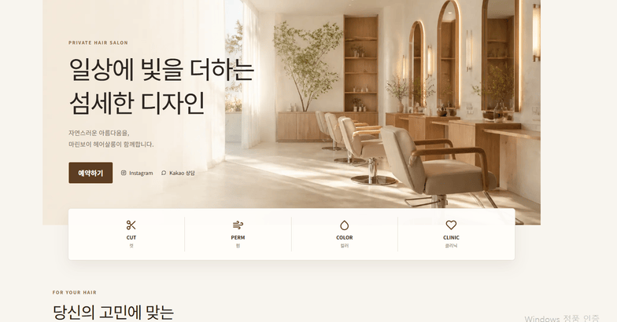
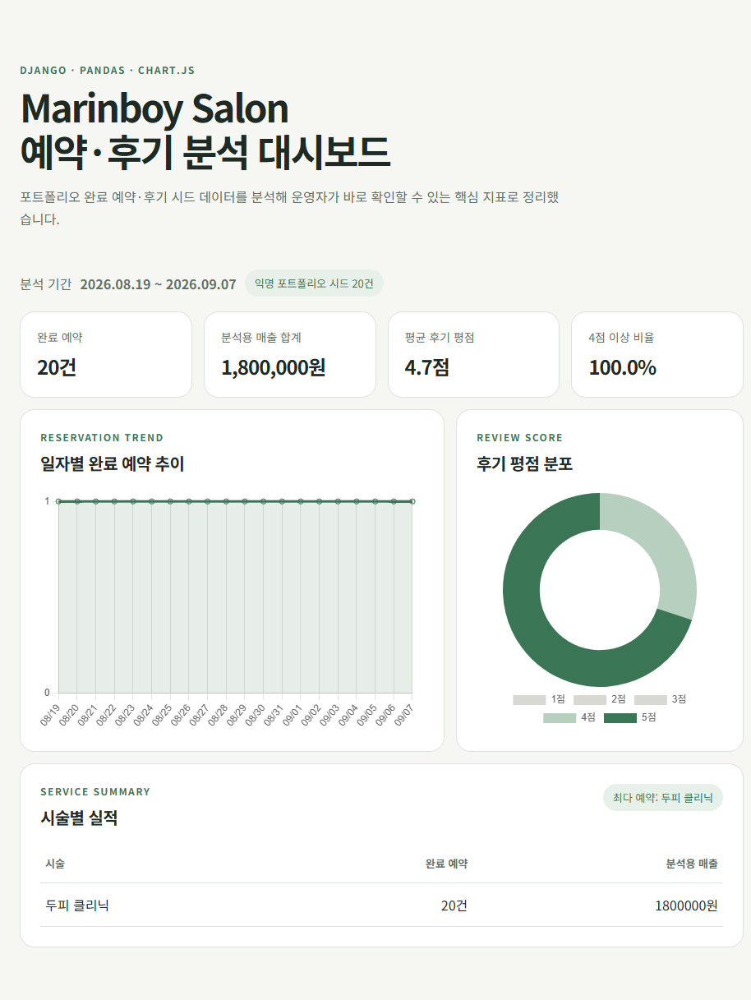

# 💇 [MarinboySalon — 1인 헤어살롱 예약·운영 플랫폼](https://marinboysalon.duckdns.org/)

<h3 align="center">고객 예약부터 관리자 운영까지 연결한 웹·모바일 풀스택 플랫폼</h3>

## ✨ 화면 포트폴리오

> 고객 화면 → 예약 과정 → GIF를 클릭하면 배포 서비스가 새 탭에서 열립니다.

  

고객 서비스 · 로그인과 예약 · 내 예약 · 관리자 예약·시술·이벤트·계정 관리

V4 Flutter 앱도 같은 예약 API와 DB를 사용합니다. 직원관리·직원배정·근무표는 제외했습니다.

  
  
  
  

  
  
  
  
  
  

---

| 바로 보기 | 설명 |
| --- | --- |
| [V3 배포 서비스](https://marinboysalon.duckdns.org/) | 기존 웹 서비스와 고객·관리자 예약 흐름을 확인합니다. |
| [V4 Flutter 앱](https://marinboysalon.duckdns.org/v4/) | 웹 배포본에서 Flutter 앱의 고객 예약·관리자 예약 기능을 확인합니다. |
| [GitHub 저장소](https://github.com/marlboros9889/MarinboySalon) | 프로젝트 전체 소스코드를 확인합니다. |
| [V3 프로젝트 문서](MarinboySalon_v3/README.md) | 문제 해결 방식, 기술 스택, 검증 결과를 확인합니다. |
| [V4 실행 안내](MarinboySalon_v4/README.md) | Flutter 실행 방법과 API 연결 설정을 확인합니다. |
| [결과보고서 Google Slides](https://docs.google.com/presentation/d/1FMPtkHiUKbO0gKgb6H1kmECF7Pqv6Wlt54C_qfGMpTc/edit) · [PPTX](MarinboySalon_v3/docs/portfolio/MarinboySalon_V4_Project_Presentation.pptx) | V3와 V4의 기획·설계·구현·검증 자료입니다. |
| [Django 분석 대시보드](MarinboySalon_v3/portfolio-dashboard/README.md) | 예약·후기 데이터를 Django·Pandas·Chart.js로 분석한 포트폴리오입니다. |
| [최종 점검 문서](docs/PORTFOLIO_FINAL_GUIDE.md) | 실행 및 포트폴리오 점검 기준을 확인합니다. |

## 🗂️ 버전 구성

| 버전 | 역할 | 주요 기술 |
| --- | --- | --- |
| [V1](MarinboySalon_v1/README.md) | 예약 기능의 기본 흐름 학습 | Spring MVC, JSP, MyBatis, MySQL |
| [V2](MarinboySalon_v2/README.md) | 관리자 기능과 예약 운영 확장 | Spring Boot, Spring Security, MyBatis |
| [V3](MarinboySalon_v3/README.md) | 웹 서비스와 공통 REST API | Next.js, Spring Boot, MyBatis, MySQL, Redis |
| [V4](MarinboySalon_v4/README.md) | V3 API·DB를 공유하는 앱 | Flutter, Dart, Riverpod, Dio |

> V1·V2는 학습 과정을 보존한 버전입니다. 웹 서비스는 V3를 유지하고, V4는 기존 백엔드에 연결하는 별도 앱으로 확장했습니다.

## 프로젝트 한눈에 보기

| 구분 | 내용 |
| --- | --- |
| 고객 기능 | 시술 조회, 일반·소셜 로그인, 예약 가능 시간 조회, 예약 등록·조회·취소 |
| 관리자 앱 | 예약 현황과 상태 변경, 예약 데이터 기준 예상 매출 확인 |
| 공통 구조 | V3 Next.js 웹 · V4 Flutter 앱 ↔ Spring Boot REST API ↔ MySQL·Redis |
| 외부 연동 | OAuth(Google·Kakao·Naver), Google Calendar(운영 키·권한 설정 필요) |
| 제외 범위 | 직원관리 · 직원배정 · 근무표 |
| 운영 | AWS EC2와 Nginx 기반 배포, GitHub Actions CI/CD |

V4는 V3의 모든 웹 화면을 복제하지 않습니다. 두 클라이언트가 계정·시술·예약 데이터와 서버 검증을 공유하고, 후기·시술 편집·이벤트 같은 V3 전용 화면은 웹에서 계속 제공합니다.

## 📊 예약·후기 분석 대시보드

완료 예약·후기 시드 20건을 익명 분석 CSV로 분리한 뒤, Django SQLite와 Pandas로 집계하고 Chart.js로 시각화했습니다.

  

| 결과 | 바로 보기 |
| --- | --- |
| 완료 예약 20건 · 분석용 매출 1,800,000원 · 평균 평점 4.7점 | [소스·실행 방법](MarinboySalon_v3/portfolio-dashboard/README.md) · [분석 결과보고서](MarinboySalon_v3/portfolio-dashboard/report/ANALYSIS_REPORT.md) |

## ✅ 검증 범위

- V3: 백엔드 테스트·JAR 빌드, 프런트엔드 Jest·Next.js 운영 빌드
- V4: Flutter 정적 분석·테스트, 웹 빌드·Android APK 빌드
- 운영: V3 웹, V4 웹, health 및 DB 연동 API의 읽기 응답 확인
- 운영 DB 직접 변경 쿼리는 실행하지 않았습니다.
