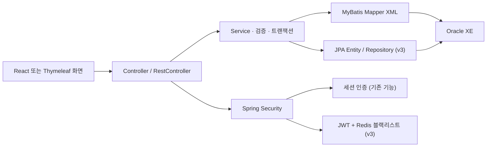
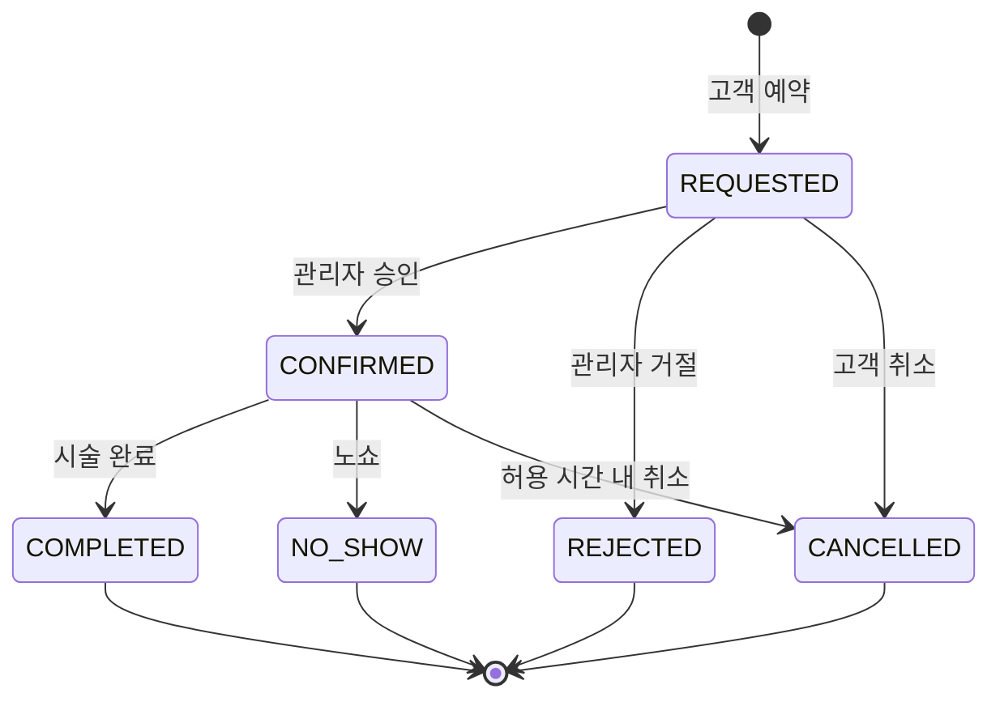

# Marinboy v2 기준 기능 흐름과 v3 확장

## 전체 구조

## 기능별 흐름

| 기능 | 처리 흐름 | 주요 경로 |
|---|---|---|
| 일반 로그인 | 화면 → `AuthController` → `AuthService` → `AuthMapper/auth.xml` → BCrypt 검증 → 세션 | `/api/auth/login` |
| 소셜 로그인 | 공급자 인증 → Spring OAuth2 콜백 → `SocialLoginSuccessHandler` → 고객 조회/생성 → 세션 | `/oauth2/authorization/{provider}` |
| v3 JWT | React → `V3AuthController` → `AuthService` → JWT 발급 → 요청 필터 → Redis 로그아웃 차단 | `/api/v3/auth/**` |
| 시술 조회 | 화면 → `ReservationController` → `MenuService` → `MenuMapper/menu.xml` → DB | `/api/services` |
| v3 시술 CRUD | React/API → `V3ServiceItemController` → RequestDto → Service → Entity/Repository → ResponseDto | `/api/v3/service-items` |
| 가능 시간 | 시술·날짜 → `ReservationService` → 영업시간/휴무일/기존 예약 겹침 계산 → 시간 슬롯 | `/api/services/{id}/available-slots` |
| 예약 | 예약 폼 → `ReservationController` → `ReservationService` 검증 → `ReservationMapper/reservation.xml` → DB | `/api/reservations` |
| 내 예약 | 세션 전화번호 소유권 확인 → 조회/미래 예약 수정·취소 → DB | `/api/customers/my-reservations/**` |
| 관리자 | 관리자 역할 확인 → 예약 상태 전이·거절·휴무일·메뉴 관리 → Service/Mapper → DB | `/api/admin/**` |

## 예약 상태 흐름

> v2의 예약·관리자 MyBatis 흐름을 호환 기준으로 유지하고, v3는 React·JPA DTO CRUD·JWT/Redis·Swagger·Google/Naver OAuth 구성을 추가한다.
