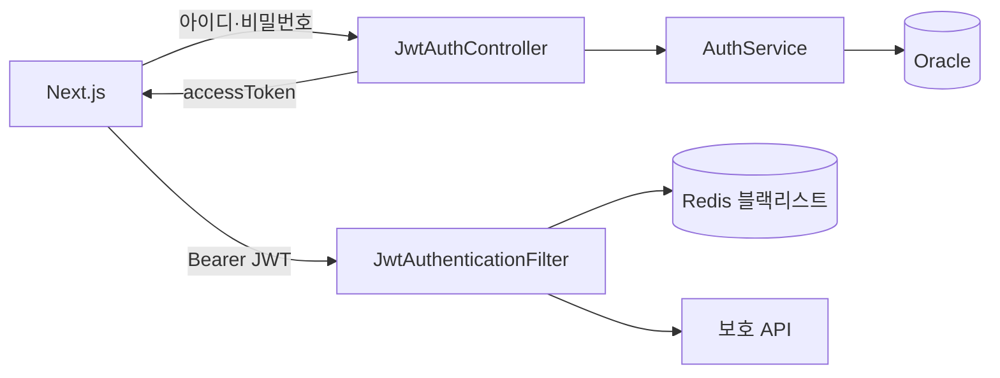

# Marinboy v3 기능 흐름

## 인증 흐름

## 기능별 흐름

| 기능 | 처리 흐름 | 주요 경로 |
|---|---|---|
| JWT 로그인·현재 사용자·로그아웃 | `JwtAuthController` → `AuthService`/`JwtTokenProvider` → Redis 차단 | `/api/auth/**` |
| 시술 조회 | `ReservationController` → `ServiceItemService` → MyBatis → Oracle | `/api/services` |
| 시술 CRUD | `ServiceItemJpaController` → DTO → JPA Service/Repository | `/api/v3/service-items` |
| 가능 시간 | 시술·날짜 → `ReservationService` → 영업시간/예약 겹침 계산 | `/api/services/{id}/available-slots` |
| 요일별 영업 규칙 | 관리자 → 영업 여부·시작/종료 시간 → `MB_BUSINESS_HOUR` | `/api/admin/business-hours/**` |
| 특정 휴무일 | 관리자 → 날짜·사유 등록/해제 → `MB_HOLIDAY` | `/api/admin/holidays` |
| 예약·내 예약 | JWT principal 소유권 확인 → `ReservationService` → MyBatis | `/api/reservations`, `/api/customers/my-reservations/**` |
| 관리자 | JWT `ADMIN` 권한 → 예약·휴무일·메뉴 관리 | `/api/admin/**` |
| 실시간 알림 | Bearer JWT 스트리밍 요청 → `NotificationController` → SSE | `/api/admin/notifications/stream` |

v2의 세션 기능은 `marinboy_v2` 폴더 안에서만 동작하며 v3 코드 경로에 섞지 않습니다.
